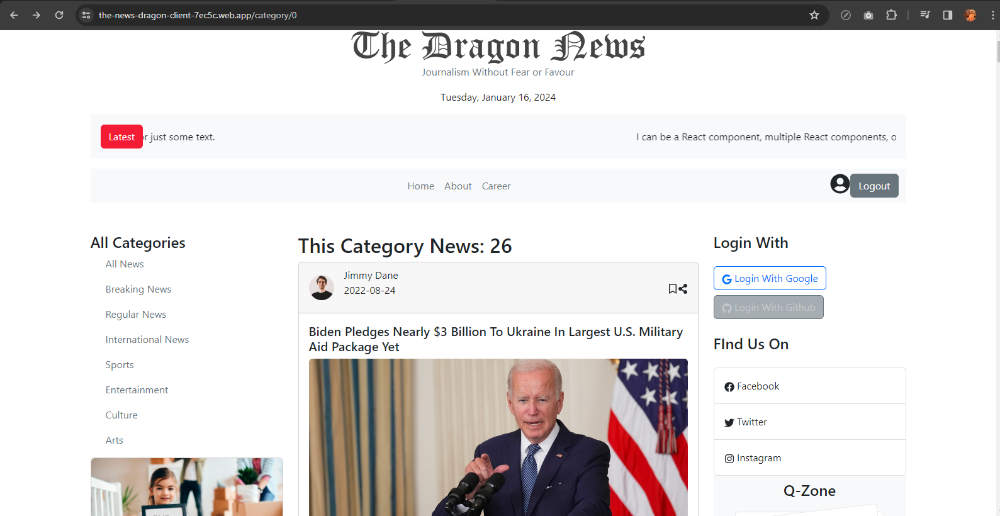

# The dragon news



This project is created with vite + react using npm. This is a news website and here you can login with google or login with gitHub or create a new account. This websites data is coming from a external server. server side code https://github.com/nurullah91/the-news-dragon-server and live server https://the-news-dragon-server-nurllah91.vercel.app/


## Local installation
```
npm install
```
```
npm run dev
```


### Live website: https://the-news-dragon-client-7ec5c.web.app/